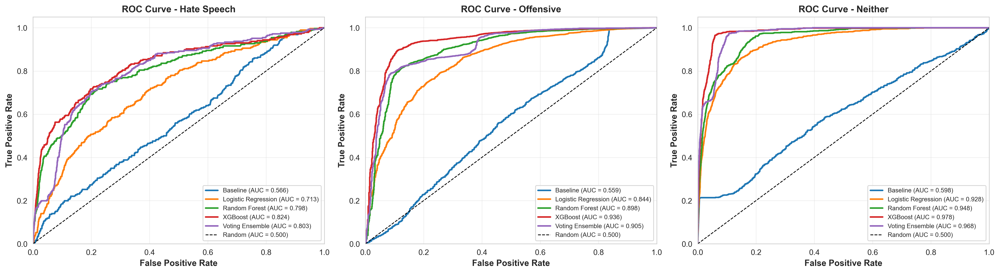
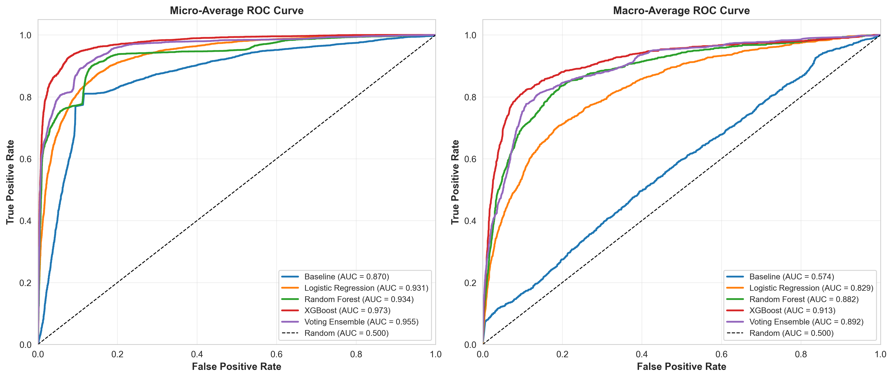
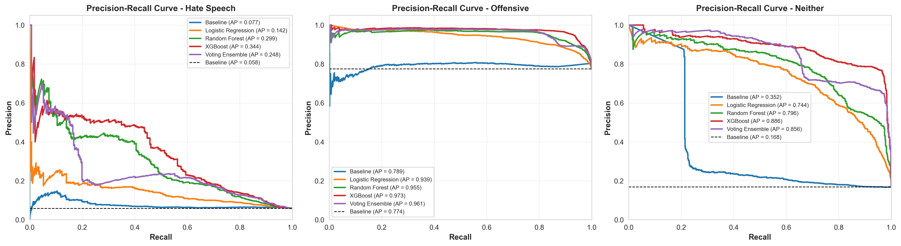

# 🛡️ Group 7 - Hate Speech Detection System


---
[English](#-group-7---hate-speech-detection-system-english) | [简体中文](#-group-7---仇恨言论检测系统-简体中文)
---

<a name="-group-7---hate-speech-detection-system-english"></a>
## 📖 Project Overview (English)

**Hate Speech Detection System** is an NLP-based system designed to detect and categorize hate speech in online text. Developed by **Group 7** for our NLP course project, this system leverages a hybrid approach combining traditional linguistic features and **BERT embeddings**.

The system classifies text into **Hate Speech**, **Offensive Language**, or **Neutral**, provides confidence score analysis, and implements **keyword masking** for sensitive terms.

### ✨ Key Features

- **🚀 Hybrid Model Architecture**: 
  - Integrates **pre-trained BERT contextual embeddings** as semantic feature representations.
  - Utilizes **TF-IDF & Weighted TF-IDF** for keyword importance.
  - Incorporates **Sentiment Analysis** & **Dependency Parsing** features (Note: Dependency features are used as auxiliary inputs).
  - **Ensemble Voting Classifier** (Logistic Regression + Random Forest + XGBoost) for robust predictions.

- **📊 Comprehensive Analysis**:
  - Classification: `Hate Speech` | `Offensive` | `Neither`.
  - Confidence score visualization for each category.

- **🛡️ Mitigation Features**:
  - **Keyword Masking**: Automatically detects and masks explicit hate terms.
  - **Sensitive Word Dictionary**: Built-in dictionary for keyword filtering.

- **🖥️ Interactive UI**:
  - User-friendly web interface built with **Streamlit**.

---

<a name="-group-7---仇恨言论检测系统-简体中文"></a>
## 📖 项目简介 (简体中文)

**Hate Speech Detection System** 是一个基于 NLP 技术的仇恨言论检测系统。本项目由 **第七组 (Group 7)** 开发，作为自然语言处理课程作业，采用了结合传统语言学特征与 **BERT** 嵌入的混合模型方法。

该系统将文本分类为 **仇恨言论**、**攻击性语言** 或 **正常言论**，提供置信度分析，并具备 **关键词屏蔽** 功能。

### ✨ 核心功能

- **🚀 混合模型架构**: 
  - 集成 **预训练 BERT 的上下文语义向量作为特征表示**。
  - 利用 **TF-IDF & 加权 TF-IDF** 捕捉关键词特征。
  - 融合 **情感分析** 与 **依存句法分析** 特征 (注：依存句法仅作为辅助特征)。
  - **投票集成分类器 (Voting Ensemble)**: 结合逻辑回归、随机森林和 XGBoost，提供稳健的预测能力。

- **📊 全面分析**:
  - 多分类检测: `仇恨言论` | `攻击性语言` | `正常言论`。
  - 为每个类别提供详细的置信度评分可视化。

- **🛡️ 缓解功能**:
  - **关键词屏蔽**: 自动识别并打码显式仇恨词汇（如 `h*te`）。
  - **敏感词词典**: 内置关键词过滤词典。

- **🖥️ 交互式界面**:
  - 基于 **Streamlit** 构建的现代化 Web 界面，操作简便。

---

## 📊 Model Performance / 模型性能

We evaluated our ensemble model using various metrics. Below are the ROC and Precision-Recall curves:
我们使用多种指标评估了集成模型。以下是 ROC 曲线和精确率-召回率曲线：

### ROC Curves (ROC 曲线)
| Multiclass ROC (多分类) | Averaged ROC (平均) |
|:---:|:---:|
|  |  |

### Precision-Recall Curves (PR 曲线)
| Multiclass PR (多分类) | Averaged PR (平均) |
|:---:|:---:|
|  |  |

---

## 🛠️ Technology Stack / 技术栈

| Component / 组件 | Technology / 技术 | Description / 说明 |
|------------------|-------------------|-------------------|
| **Core / 核心** | Python | Primary programming language / 主要编程语言 |
| **NLP** | Transformers (BERT) | Feature extraction / 特征提取 |
| **ML / 机器学习** | Scikit-learn, XGBoost | Classifiers / 分类器 |
| **Frontend / 前端** | Streamlit | Web Application / Web 应用界面 |
| **Data / 数据** | Pandas, NumPy | Data processing / 数据处理 |
| **Viz / 可视化** | Matplotlib, Seaborn | Performance plots / 性能图表 |

## 🚀 Getting Started / 快速开始

### 1. Installation / 安装

```bash
# Clone the repository / 克隆仓库
git clone https://github.com/ItWorksOnMyMachine137/Group7-NLP-HateSpeech-detection.git
cd Group7-NLP-HateSpeech-detection

# Install dependencies / 安装依赖
pip install -r requirements.txt
```

### 2. Resources Setup / 资源准备
Ensure model files are in `saved_models/` and dictionaries in `dictionaries/`.
请确保模型文件位于 `saved_models/` 目录，词典文件位于 `dictionaries/` 目录。

### 3. Usage / 使用方法

**Run the Web Application / 启动 Web 应用:**
```bash
streamlit run apppro.py
```

**Retrain the Model / 重新训练模型:**
```bash
python hate_speech_detection_with_bert.py
```


## 🙏 Acknowledgements / 致谢

This project was inspired by and built upon the open-source work of **[tpawelski/hate-speech-detection](https://github.com/tpawelski/hate-speech-detection)**. We have extended the original work by integrating BERT embeddings, developing a web interface, and enhancing the feature engineering process.

Data sources include:
*   **Hatebase.org**: For the initial hate speech dictionary.
*   **Jeffrey Breen's Twitter Sentiment Analysis**: For positive/negative sentiment lexicons.

本项目借鉴并基于开源项目 **[tpawelski/hate-speech-detection](https://github.com/tpawelski/hate-speech-detection)** 进行开发。我们在原作基础上进行了扩展，集成了 BERT 嵌入、开发了 Web 界面，并优化了特征工程流程。

数据来源包括：
*   **Hatebase.org**: 用于初始仇恨词典。
*   **Jeffrey Breen 的 Twitter 情感分析教程**: 用于情感词典。

---
*Developed for NLP Course Project, NLP 课程作业*
